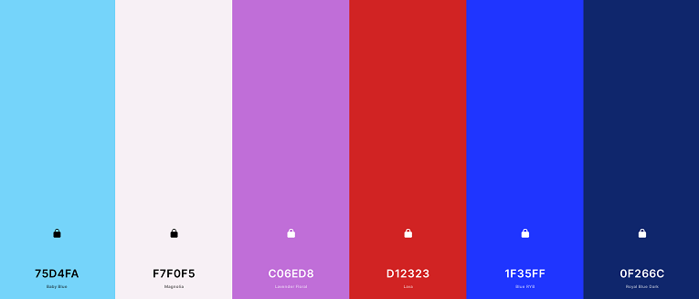

[](https://github.com/StephenJ2020/Sportmaster/index.html) 

[Sportmaster - Live Site](https://github.com/StephenJ2020/Sportmaster/index.html)  

    
   
 
# Project Overview 
___ 
## Project Description   
**Code Institute: Full Stack Frameworks with Django - Milestone 4 Project**   
   
The Milestone 4 project assignment is to build a full-stack site based around business logic used to control a centrally-owned dataset.  To set up an authentication mechanism and provide paid access to the site's data and/or other activities based on the dataset, such as the purchase of a product/service. I have the option to choose from one of the following two scenarios or to come up with my own idea:   
. Build a fitness subscription application     
. Build a site to sell your graphic design services   
    
I have decided to create a   
   
## Project Requirements   
 
### Main Technologies   
. HTML, CSS, JavaScript, Python+Django    
  
. Relational database (recommending MySQL or Postgres)  
  
. Stripe payments    
  
. Additional libraries and APIs    
          
  
### Mandatory Requirements       
1. Django Full Stack Project: Build a Django project backend by a relational database to create a website that allows users to store and manipulate data records about a particular domain.   
2. Multiple Apps: The project must be a brand new Django project, composed of multiple apps (an app for each potentially reusable component in your project).   
3. Data Modeling: Put some effort into designing a relational database schema well-suited for your domain. Make sure to put some thought into the relationships between entities. Create at least 2 custom django models beyond the examples shown on the course (changing the field names of the miniproject models is not customisation)   
4. User Authentication: The project should include an authentication mechanism, allowing a user to register and log in, and there should be a good reason as to why the users would need to do so. e.g., a user would have to register to persist their shopping cart between sessions (otherwise it would be lost).    
5. User Interaction: Include at least one form with validation that will allow users to create and edit models in the backend (in addition to the authentication mechanism).   
6. Use of Stripe: At least one of your Django apps should contain some e-commerce functionality using Stripe. This may be a shopping cart checkout or single payments, or donations, etc. After paying successfully, the user would then gain access to additional functionality/content on the site. Note that for this project you should use Stripe's test functionality, rather than actual live payments.   
7. Structure and Navigation: Incorporate a main navigation menu and structured layout (you might want to use Bootstrap to accomplish this).   
8. Use of JavaScript: The frontend should contain some JavaScript logic you have written to enhance the user experience.   
9. Documentation: Write a README.md file for your project that explains what the project does and the value that it provides to its users.   
10. Version Control: Use Git & GitHub for version control.   
11. Attribution: Maintain clear separation between code written by you and code from external sources (e.g. libraries or tutorials). Attribute any code from external sources to its source via comments above the code and (for larger dependencies) in the README.   
12. Deployment: Deploy the final version of your code to a hosting platform such as Heroku.    
13. Security: Make sure to not include any passwords or secret keys in the project repository. Make sure to turn off the Django DEBUG mode, which could expose secrets.   
        
          
            
    
# Sportmaster  
------  
## [Table of Contents](#table-of-contents)

- [UX](#ux)
  * [Strategy](#strategy)
  * [User Stories](#user-stories)
  * [Scope](#scope)
  * [Structure](#structure)
  * [Skeleton](#skeleton)
  * [Surface](#surface)
    + [Color Scheme](#color-scheme)
    + [Typography](#typography)
    + [Imagery](#imagery)
- [Technologies Used](#technologies-used)
  * [Languages](#languages)
  * [Frameworks, Libraries, Programs & Platforms Used:](#frameworks--libraries--programs---platforms-used-)
- [Features](#features)
  * [Implemented Features](#implemented-features)
  * [Future Features](#future-features)
- [Bugs & Fixes](#bugs---fixes)
- [Deployment](#deployment)
  * [Deployment Steps](#deployment-steps)
  * [Making a clone to run locally](#making-a-clone-to-run-locally)
  * [How to Fork the respository](#how-to-fork-the-respository)
  * [Making a Local Clone](#making-a-local-clone)
- [Testing](#testing)
  * [Code Validity](#code-validity)
  * [Testing User Stories](#testing-user-stories)
- [Credits](#credits)
- [Acknowledgements](#acknowledgements)   
  

# UX
___
## Strategy

* **Project Goals**
    * To create a fully functioning eCommerce site for Sportmaster, a local sports shop in Celbridge, co. Kildare.  
    * To allow users to easily view, filter and search for any item available from this shop.  
    * To allow users to make a safe & secure purchase as conveniently as possible.  
    * To allow users to create a user profile to keep track of their order history and to speed up the purchase process for future purchases.  

* **Business Goals**   
    * To offer their existing customers an alternative to instore shopping as an added convenience.  
    * To have a clean, fresh, modern, professional looking website that can be used as a marketing tool to highlight their range of products to potential new customers.
    * To increase their sales by reaching new customers from outside their immediate physical location.

* **Target audience**
    * The primary target audience are sports enthusiasts in the wider Celbridge and North Kildare area.
    * The secondary target audience are sports enthusiasts from outside of the shops physical location but primarily within Ireland.  


## User Stories

* **As a first time user I want to be able to:**  

    * Clearly understand the purpose of the website.  
    * Easily navigate around the website. 
    * View all the products the website is selling. 
    * Filter products by category. 
    * Filter products by price or alphabetical order.
    * Search for a specific product. 
    * View detailed information about each individual products on a separate page. 
    * Choose the size, change the quantity and add a product to a shopping basket.
    * View a full list of items within the shopping basket with a breakdown of the individual costs.
    * View, update & remove products within my shopping basket. 
    * Easily see in the Navbar the current total of any items within the shopping basket.  
    * Securely checkout and purchase the products within my shopping basket. 
    * Receive an order confirmation on-screen and by email upon completion of my purchase.
    * Register and create a user profile.   
    * Contact the stores owners if I have a query.

   
* **As a returning user I want to be able to:**  
    * Login and out of the website with ease. 
    * View my user profile. 
    * Save default delivery details in order to speed up future purchases.   
    * Update my default delivery details.  
    * View my order history. 
  
  
* **As the site owner I want:**
    * Customers to be able to view the full list of products available for purchase.  
    * Customers to be able to filter products by category, price or alphabetical order.  
    * Customers to be able to select and purchase products as quick & easily as possible.  
    * Customers to be able to add, edit, update or delete products within their shopping basket.
    * Customers to be able to read product reviews prior to making a purchase.  
    * Customers to be able to write product reviews after making a purchase.  
    * Customers to be able to read our product blog about new or featured products.  
    * To be able to maintain & update the website via an Admin panel.  
    * To be able to add, edit, update or delete products from the website.  
    * To be able to add, edit, update or delete blog posts from the website.  
  

[:top:](#Sportmaster)

## Scope  
------  
* 

  
## Structure  
------  
The app consists of ........  
  
## Skeleton
------  
* 
  
  
[:top:](#Sportmaster)
  

## Surface 
-----
### Color Scheme  
  
I have chosen a very bright and vibrant colour palette to reflect the active and sporty nature of the products being sold via the site by Sportmaster.  
  
To create the color palette I used [Coolors](https://coolors.co/).  


### Typography

* 
  
### Imagery  

**(imagery choice goes here)**  
  
  
  
# Technologies Used  
------  
## Languages
 

## Frameworks, Libraries, Programs & Platforms Used:   


[:top:](#Sportmaster)

# Features  
------  

## Implemented Features
*   

  
  
## Future Features
  

  
  
# Bugs & Fixes  
------  
**Bugs and fixes to go here**  


  
[:top:](#Sportmaster)

# Deployment  
------  
  
## Deployment Steps  
  
This project was deployed to ..........
  
  
## Making a clone to run locally  
  
It is important to note that this project will not run locally unless an env.py file has been set up by the user which contains the IP, PORT, MONGO_DBNAME, MONGO_URI and SECRET_KEY which have all been kept secret in keeping with best security practices.  
  
1. Log into GitHub.  
2. Select the [respository](https://github.com/StephenJ2020/Sportmaster).    
3. Click the Code dropdown button next to the green Gitpod button.  
4. Download ZIP file and unpackage locally and open with IDE. Alternatively copy the URL in the HTTPS box.  
6. Type 'git clone' and paste the copied URL.  
7. Press Enter. A local clone will be created.  
  
Once the project been loaded into the IDE it is necessary to install the necessary requirements which can be done by typing the following command.  
  
    -pip install -r requirements.txt  
  
    
## How to Fork the respository  
  
By forking the GitHub Repository you make a copy of the original repository on your own GitHub account to view and/or make changes without affecting the original repository by following these simple steps:  
  
1. Log in to GitHub and locate the [StephenJ2020/Sportmaster Repository](https://github.com/StephenJ2020/Sportmaster)  
2. Near the top of the Repository, on the right-hand side of the screen, locate the "Fork" button.  
3. Click this button and you should now have a copy of the original repository in your GitHub account.  
    
## Making a Local Clone 
  
1. Log in to GitHub and locate the [StephenJ2020/Sportmaster Repository](https://github.com/StephenJ2020/Sportmaster)  
2. Under the repository name, click "Clone or download".  
3. To clone the repository using HTTPS, under "Clone with HTTPS", copy the link.  
4. Open Git Bash  
5. Change the current working directory to the location where you want the cloned directory to be made.  
6. Type `git clone`, and then paste the URL you copied in Step 3.  
```  
$ git clone https://github.com/StephenJ2020/Sportmaster  
```  
7. Press Enter. Your local clone will be created.  
```  
$ git clone https://github.com/StephenJ2020/Sportmaster  
> Cloning into `CI-Clone`...  
> remote: Counting objects: 10, done.  
> remote: Compressing objects: 100% (8/8), done.  
> remove: Total 10 (delta 1), reused 10 (delta 1)  
> Unpacking objects: 100% (10/10), done.  
```   

[:top:](#Sportmaster)

# Testing  
------  
## Code Validity

  
## Testing User Stories
* *First time user stories:*
    * 
    * 

* *Returning user stories:*


  
# Credits  
------  
* Table of contents generated with [markdown-toc](http://ecotrust-canada.github.io/markdown-toc/).
* Favicon is taken from [Flaticon](https://www.flaticon.com/).  
* Hero Image - [Homepage](https://unsplash.com/photos/Gh8QHONEHOE) 
*   " [Homepage](https://unsplash.com/photos/lrQPTQs7nQQ)  

*   
  - 
  


# Acknowledgements  
------  
*  
*   

  


[:top:](#Sportmaster)