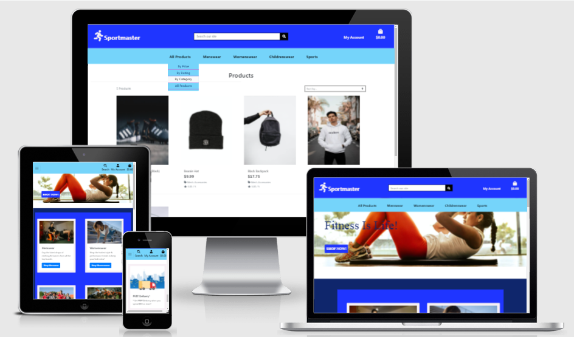

[](https://github.com/StephenJ2020/Sportmaster/index.html) 

[Sportmaster - Live Site](https://github.com/StephenJ2020/Sportmaster/index.html)  

    
   
 
# Project Overview 
___ 
## Project Description   
**Code Institute: Full Stack Frameworks with Django - Milestone 4 Project**   
   
The Milestone 4 project assignment is to build a full-stack site based around business logic used to control a centrally-owned dataset.  To set up an authentication mechanism and provide paid access to the site's data and/or other activities based on the dataset, such as the purchase of a product/service. I have the option to choose from one of the following two scenarios or to come up with my own idea:   
. Build a fitness subscription application     
. Build a site to sell your graphic design services   
    
I have decided to create an eCommerce site for a local sports shop called Sportmaster.  This is a small family run business who don't currently have a website but they did use Facebook during the various pandemic related lockdowns to offer a "click & collect" service.  This highlighted to me their clear need for a fully functioning eCommerce website.
   
## Project Requirements   
 
### Main Technologies   
. HTML, CSS, JavaScript, Python+Django    
  
. Relational database (recommending MySQL or Postgres)  
  
. Stripe payments    
  
. Additional libraries and APIs    
          
  
### Mandatory Requirements       
1. Django Full Stack Project: Build a Django project backend by a relational database to create a website that allows users to store and manipulate data records about a particular domain.   
2. Multiple Apps: The project must be a brand new Django project, composed of multiple apps (an app for each potentially reusable component in your project).   
3. Data Modeling: Put some effort into designing a relational database schema well-suited for your domain. Make sure to put some thought into the relationships between entities. Create at least 2 custom django models beyond the examples shown on the course (changing the field names of the miniproject models is not customisation)   
4. User Authentication: The project should include an authentication mechanism, allowing a user to register and log in, and there should be a good reason as to why the users would need to do so. e.g., a user would have to register to persist their shopping cart between sessions (otherwise it would be lost).    
5. User Interaction: Include at least one form with validation that will allow users to create and edit models in the backend (in addition to the authentication mechanism).   
6. Use of Stripe: At least one of your Django apps should contain some e-commerce functionality using Stripe. This may be a shopping cart checkout or single payments, or donations, etc. After paying successfully, the user would then gain access to additional functionality/content on the site. Note that for this project you should use Stripe's test functionality, rather than actual live payments.   
7. Structure and Navigation: Incorporate a main navigation menu and structured layout (you might want to use Bootstrap to accomplish this).   
8. Use of JavaScript: The frontend should contain some JavaScript logic you have written to enhance the user experience.   
9. Documentation: Write a README.md file for your project that explains what the project does and the value that it provides to its users.   
10. Version Control: Use Git & GitHub for version control.   
11. Attribution: Maintain clear separation between code written by you and code from external sources (e.g. libraries or tutorials). Attribute any code from external sources to its source via comments above the code and (for larger dependencies) in the README.   
12. Deployment: Deploy the final version of your code to a hosting platform such as Heroku.    
13. Security: Make sure to not include any passwords or secret keys in the project repository. Make sure to turn off the Django DEBUG mode, which could expose secrets.   
        
          
            
    
# Sportmaster  
------  
## [Table of Contents](#table-of-contents)

- [UX](#ux)
  * [Strategy](#strategy)
  * [User Stories](#user-stories)
  * [Scope](#scope)
  * [Structure](#structure)
  * [Skeleton](#skeleton)
  * [Surface](#surface)
    + [Color Scheme](#color-scheme)
    + [Typography](#typography)
    + [Imagery](#imagery)
- [Technologies Used](#technologies-used)
  * [Languages](#languages)
  * [Frameworks, Libraries, Programs & Platforms Used:](#frameworks--libraries--programs---platforms-used-)
- [Features](#features)
  * [Implemented Features](#implemented-features)
  * [Future Features](#future-features)
- [Bugs & Fixes](#bugs---fixes)
- [Deployment](#deployment)
  * [Deployment Steps](#deployment-steps)
  * [Making a clone to run locally](#making-a-clone-to-run-locally)
  * [How to Fork the respository](#how-to-fork-the-respository)
  * [Making a Local Clone](#making-a-local-clone)
- [Testing](#testing)
  * [Code Validity](#code-validity)
  * [Testing User Stories](#testing-user-stories)
- [Credits](#credits)
- [Acknowledgements](#acknowledgements)   
  

# UX
___
## Strategy

* **Project Goals**
    * To create a fully functioning eCommerce site for Sportmaster, a local sports shop in Celbridge, co. Kildare.  
    * To allow users to easily view, filter and search for any item available from this shop.  
    * To allow users to make a safe & secure purchase as conveniently as possible.  
    * To allow users to create a user profile to keep track of their order history and to speed up the purchase process for future purchases.  

* **Business Goals**   
    * To offer their existing customers an alternative to instore shopping as an added convenience.  
    * To have a clean, fresh, modern, professional looking website that can be used as a marketing tool to highlight their range of products to potential new customers.
    * To increase their sales by reaching new customers from outside their immediate physical location.

* **Target audience**
    * The primary target audience are sports enthusiasts in the wider Celbridge and North Kildare area.
    * The secondary target audience are sports enthusiasts from outside of the shops physical location but primarily within Ireland.  


## User Stories

* **As a first time user I want to be able to:**  

    * Clearly understand the purpose of the website.  
    * Easily navigate around the website. 
    * View all the products the website is selling. 
    * Filter products by category. 
    * Filter products by price or alphabetical order.
    * Search for a specific product. 
    * View detailed information about each individual products on a separate page. 
    * Choose the size, change the quantity and add a product to a shopping basket.
    * View a full list of items within the shopping basket with a breakdown of the individual costs.
    * View, update & remove products within my shopping basket. 
    * Easily see in the Navbar the current total of any items within the shopping basket.  
    * Securely checkout and purchase the products within my shopping basket. 
    * Receive an order confirmation on-screen and by email upon completion of my purchase.
    * Register and create a user profile.   
    * Contact the stores owners if I have a query.

   
* **As a returning user I want to be able to:**  
    * Login and out of the website with ease. 
    * View my user profile. 
    * Save default delivery details in order to speed up future purchases.   
    * Update my default delivery details.  
    * View my order history. 
  
  
* **As the site owner I want:**
    * Customers to be able to view the full list of products available for purchase.  
    * Customers to be able to filter products by category, price or alphabetical order.  
    * Customers to be able to select and purchase products as quick & easily as possible.  
    * Customers to be able to add, edit, update or delete products within their shopping basket.
    * Customers to be able to read product reviews prior to making a purchase.  
    * Customers to be able to write product reviews after making a purchase.  
    * Customers to be able to read our product blog about new or featured products.  
    * To be able to maintain & update the website via an Admin panel.  
    * To be able to add, edit, update or delete products from the website.  
    * To be able to add, edit, update or delete blog posts from the website.  
  

[:top:](#Sportmaster)

## Scope  
------  
* 

  
## Structure  
------  
The app consists of ........  
  
## Skeleton
------  
* 
  
  
[:top:](#Sportmaster)
  

## Surface 
-----
### Color Scheme  
  
I have chosen a very bright and vibrant colour palette to reflect the active and sporty nature of the products being sold via the site by Sportmaster.  Plus the sporting colours of the local Celbridge G.A.A. and football teams are white and blue so my colour scheme reflects this.  
  
To create the color palette I used [Coolors](https://coolors.co/).  


### Typography

* 
  
### Imagery  

**(imagery choice goes here)**  
  
  
  
# Technologies Used  
------  
## Languages  
-  [__HTML5__](https://en.wikipedia.org/wiki/HTML5)

*  [__CSS3__](https://en.wikipedia.org/wiki/Cascading_Style_Sheets)  
 
-  [__Javascript__](https://en.wikipedia.org/wiki/JavaScript)  
  
-  [__Python__](https://en.wikipedia.org/wiki/Python_(programming_language))  

## Frameworks, Libraries, Programs & Platforms Used:   

* [__Django 3.2__](https://www.djangoproject.com/) This was the main framework used to build the app. 
  - Django extensions used  
     * [Django Allauth](https://django-allauth.readthedocs.io/en/latest/)  
     * [Django Countries](https://pypi.org/project/django-countries/)  
     * [Django Crispy Forms](https://django-crispy-forms.readthedocs.io/en/latest/)  
     * [Django-Storages](https://django-storages.readthedocs.io/en/latest/)  
* [__jquery 3.6.0__](https://blog.jquery.com/) Javascript framework used to create some of the site's interactive functions.  
* [__Bootstrap 4__](https://getbootstrap.com/docs/4.1/getting-started/introduction/) Bootstrap Grid was used for responsiveness as well as features such as accordion.  
* [__Jinja__](https://jinja.palletsprojects.com/en/3.0.x/templates/) Was used to create the Python templates.   
* [__Heroku__](https://heroku.com/) The cloud platform for deploying the app.  
* [__SQlite3__](https://www.sqlite.org/index.html) The database used for development.  
* [__Heroku Postgres__](https://www.heroku.com/postgres/) PostgreSQL is the database used for the production site. 
* [__Stripe__](https://stripe.com/ie) Online payment system.
* [__AWS-S3__](https://aws.amazon.com/s3/) Amazon Object storage service.  

* [__Google Fonts__](https://fonts.google.com) used for project fonts.  
* [__Gitpod__](https://gitpod.io) Gitpod was the IDE used to create the site and for version control.  
* [__Github__](https://github.com/) GitHub is used to store the projects code after being pushed from Gitpod.  
* [__Balsamiq__](https://balsamiq.com) Balsamiq was used to create wireframes during the design process.
* [__Django Secret Key Generator__](https://miniwebtool.com/django-secret-key-generator/) to generate the required key.   
* [__Fontawesome__](https://fontawesome.com) Font Awesome was used for the Icons throughout the site.  
* [__coolors.co__](https://coolors.co/384364-ffd2b0-f6f7eb-cccccc-333333) used for colour palette selection.  
* [__TinyPNG__](https://tinypng.com/) used to compress image sizes.  
* Mozilla DevTools used for debugging and testing.  
* Google DevTools used for debugging and testing.  
* [__W3Scool__](https://www.w3schools.com/) used as a general source of information.  
* [__Unsplash__](https://unsplash.com/) used to download images for the website.  
* [__Stackoverflow__](https://stackoverflow.com/) used as one of my main sources of information.  
* [__W3C Markup Validator__](https://validator.w3.org/) Used to test HTML code validation.  
* [__W3C CSS Validatior - Jigsaw__](https://jigsaw.w3.org/css-validator/) Used to test CSS code validation.  
* [__jshint Validatior__](https://jshint.com/) Used to test Javascript / JQuery code validation.
* [__PEP8 Validatior__](http://pep8online.com/) Used to test that Python code is PEP8 compliant.
* [__Mobile-Friendly Test__](https://search.google.com/test/mobile-friendly?id=ZteYI-6sVDRnrLMf_Chjmw) used to check if code is Mobile Friendly.  
* [__Am I Responsive__](http://ami.responsivedesign.is/) used to create Mock-up images to represent the site's responsiveness.  

[:top:](#Sportmaster)

# Features  
------  

## Implemented Features
*   

  
  
## Future Features
  

  
  
# Bugs & Fixes  
------  
**Bugs and fixes to go here**  

* Dropdown menus in Navbar not working:  
 - I had been using the Bootstrap 4 classes rather than the updated Bootstrap 5 classes.  
   - Thankfully I found a very helpful post on Slack by Vera which made me realise my error.  
     
  
* Media files not loading after deployment to Heroku and AWS:  
 - I needed to update the src file path from /media/image-name.jpg to {{ MEDIA_URL }}image-name.jpg  
   - I found the solution to this bug on slack.  
     

* jQuery not working properly with Bootstrap 5:  
 - The increase / decrease button and the update and remove buttons in the shopping bag wouldn't work properly.  
  - I search Slack for solutions and I looked at the Bootstrap documentation but I couldn't find a suitable solution. It appearead from Slack that many students have faced the same issue and that many had choosen to remove the increase / decrease buttons on desktop devices as their solution as the issue seems to be a duplicate ID with the Mobile Navbar.  
  I chose to strip out Bootstrap 5 and revert to Bootstrap 4 as per the Boutigue Ado Walk-Through project.  
    
* CountyField on Models.py in checkout app cause a migration error:  
 -   
  - https://github.com/saleor/saleor/issues/5352  
    https://pypi.org/project/django-countries/#countryfield  
    https://pythonrepo.com/repo/SmileyChris-django-countries-python-django-utilities  
    https://stackoverflow.com/questions/8484689/django-form-database-error-value-too-long-for-type-character-varying4 
        


  
[:top:](#Sportmaster)

# Deployment  
------  
  
## Deployment Steps  
  
This project was built using Gitpod and pushed to Github using the terminal interface. However, as Github can only host static websites the project had to be deployed to Heroku as it is compatible for hosting a back-end focused site.    
    
## Project and Repository Creation  
 1. Navigate to [Github](https://github.com).  
 2. Create a new repository by first clicking the green button labeled new on the top left of the screen.  
 3. Select the Code Institute template in the templates section.  
 4. Name the repository i.e. Sportmaster.  
 5. Click the green 'Create Repository' button at the bottom of the page.  
 6. Inside the repository click the green 'gitpod' button to initialize your repository.  
 7. Future access to this workspace must be gained through gitpod workspaces, clicking the green button in gitpod again will initialize a new workspace. (Note you should probably pin your workspace so that you don't lose it, should it be inactive for more than 2 weeks.)  
 8. Use the git add . command to add all modified and new files to the staging area.  
 9. Use the git commit -m command to commit a change to the local repository.  
 10. Use the git push command to push all committed changes to github.  
   
Before deploying the website to Heroku, the following three must be followed to allow the app to work in Heroku:

 1. Create requirements.txt file that contains the names of packages being used in Python. It is important to update this file if other packages or modules are installed during project development by using the following command:  
  
    -pip install -r requirements.txt  

 2. Create Procfile that contains the name of the application file so that Heroku knows what to run. If the Procfile has a blank line when it is created remove this as this may cause problems.  
  
 3. Push these files to GitHub.  
  
 4. Install psycopg2 and dj_datatbase_url in your workspace cli.  
  
Once those steps are done, the website can be deployed in Heroku using the steps listed below:  
  
### Deployment Steps  
 1. Log into Heroku .  
 2. Click the New button.  
 3. Click the option to create a new app.  
 4. Enter the app name in lowercase letters.  
 5. Select the correct geographical region.  
   
### Connect Heroku app to Github repository  
 1. In heroku select the deploy tab.  
 2. Click github button.  
 3. Enter the repository name and click search.  
 4. Select the relevant repository and click connect.  
  
### Add Heroku Postgres Database  
 1. Click the resources tab in heroku.  
 2. Under Add-ons search for heroku postgres.  
 3. Click on heroku postgres when it appears.  
 4. Select the Hobby Dev-Free option in plans.  
 5. Click submit order form.  
  
### Setting up environment variables   
 1. In the heroku settings click the reveal config vars button and set the following variables:   
   - SECRET_KEY   
   - DATABASE_URL  
   - AWS_ACCESS_KEY_ID  
   - AWS_SECRET_ACCESS_KEY  
   - USE_AWS  
   - STRIPE_PUBLIC_KEY  
   - STRIPE_SECRET_KEY  
   - STRIPE_WH_SECRET  
   - EMAIL_HOST_PASSWORD  
   - EMAIL_HOST_USER  
* The values of all these have been kept secret in keeping with best security practices.
    
* I used miniwebtool's [Django Secret Key Generator](https://miniwebtool.com/django-secret-key-generator/) to generate the required key.  
   
### Setting up the AWS s3 bucket  
 1. Create an Amazon AWS account  
 2. Search for S3 and create a new bucket  
    * Allow public access  
 3. Under Properties > Static website hosting  
    * Enable  
    * index.html as index.html  
    * save  
 4. Under Permissions > CORS use the following:  
[  
  {  
      "AllowedHeaders": [  
          "Authorization"  
      ],  
      "AllowedMethods": [  
          "GET"  
      ],  
      "AllowedOrigins": [  
          "*"  
      ],  
      "ExposeHeaders": []  
  }  
]    
  
  5. Under Permissions > Bucket Policy:  
     * Generate Bucket Policy and take note of Bucket ARN  
     * Chose S3 Bucket Policy as Type of Policy  
     * For Principal, enter *  
     * Enter ARN noted above  
     * Add Statement  
     * Generate Policy  
     * Copy Policy JSON Document  
     * Paste policy into Edit Bucket policy on the previous tab  
     * Save changes  
  6. Under Access Control List (ACL):  
     * For Everyone (public access), tick List  
     * Accept that everyone in the world may access the Bucket  
     * Save changes  

### AWS IAM (Identity and Access Management) setup  
  
 1. From the IAM dashboard within AWS, select User Groups:  
    * Create a new group
    * Click through and Create Group  
      
 2. Select Policies:  
    * Create policy  
    * Under JSON tab, click Import managed policy  
    * Choose AmazongS3FullAccess  
    * Edit the resource to include the Bucket ARN noted earlier when creating the Bucket Policy  
    * Click next step and go to Review policy  
    * Give the policy a name and description of your choice  
    * Create policy  
      
 3. Go back to User Groups and choose the group created earlier  
    * Under Permissions > Add permissions, choose Attach Policies and select the one just created   
    *   Add permissions 
  
 4. Under Users:  
    * Choose a user name  
    * Select Programmatic access as the Access type  
    * Click Next  
    * Add the user to the Group just created  
    * Click Next and Create User  
  
    
 5. Download the .csv containing the access key and secret access key.  
    * THE .csv FILE IS ONLY AVAILABLE ONCE AND CANNOT BE DOWNLOADED AGAIN. (so I suggest you save a copy in a secure location)  
  
### Connecting Heroku to AWS S3  

 1. Install boto3 and django-storages  
    * pip3 install boto3    
    * pip3 install django-storages  
    * pip3 freeze > requirements.txt  
 2. Add the values from the .csv you downloaded to your Heroku Config Vars under Settings:  
 3. Delete the DISABLE_COLLECTSTATIC variable from your Cvars and deploy your Heroku app  
 4.   With your S3 bucket now set up, you can create a new folder called media (at the same level as the newly added static folder) and upload any required media files to it.  
    * PLEASE MAKE SURE media AND static FILES ARE PUBLICLY ACCESSIBLE UNDER PERMISSIONS
  
### Enable automatic deployment:  
 1. Click the Deploy tab  
 2. In the Automatic deploys section, choose the branch you want to deploy from then click Enable Automation Deploys.  

* A more detailed step by step guide can be found on the project's [Wiki page](https://github.com/StephenJ2020/Sportmaster/wiki/Boutique-Ado-Notes---To-be-used-as-guidance!) and can be used as a blueprint for other similar projects.  
    
      
## How to Fork the repository  
  
By forking the GitHub Repository you make a copy of the original repository on your own GitHub account to view and/or make changes without affecting the original repository by following these simple steps:  
  
1. Log in to GitHub and locate the [StephenJ2020/Sportmaster Repository](https://github.com/StephenJ2020/Sportmaster)  
2. Near the top of the Repository, on the right-hand side of the screen, locate the "Fork" button.  
3. Click this button and you should now have a copy of the original repository in your GitHub account.  
    
## Making a Local Clone 
  
1. Log in to GitHub and locate the [StephenJ2020/Sportmaster Repository](https://github.com/StephenJ2020/Sportmaster)  
2. Under the repository name, click "Clone or download".  
3. To clone the repository using HTTPS, under "Clone with HTTPS", copy the link.  
4. Open Git Bash  
5. Change the current working directory to the location where you want the cloned directory to be made.  
6. Type `git clone`, and then paste the URL you copied in Step 3.  
```  
$ git clone https://github.com/StephenJ2020/Sportmaster  
```  
7. Press Enter. Your local clone will be created.  
```  
$ git clone https://github.com/StephenJ2020/Sportmaster  
> Cloning into `CI-Clone`...  
> remote: Counting objects: 10, done.  
> remote: Compressing objects: 100% (8/8), done.  
> remove: Total 10 (delta 1), reused 10 (delta 1)  
> Unpacking objects: 100% (10/10), done.  
```   
  
Once the project been loaded into the IDE it is necessary to install the necessary requirements which can be done by typing the following command.  
  
    -pip install -r requirements.txt    
  
It is important to note that this project will not run locally unless a `.env` file (or similar method) has been set up by the user which contains all of the following details, which have all been kept secret in keeping with best security practices:-  
   - SECRET_KEY=   
   - DATABASE_URL=  
   - AWS_ACCESS_KEY_ID=  
   - AWS_SECRET_ACCESS_KEY=  
   - USE_AWS=True  
   - STRIPE_PUBLIC_KEY=  
   - STRIPE_SECRET_KEY=  
   - STRIPE_WH_SECRET=  
   - EMAIL_HOST_PASSWORD=  
   - EMAIL_HOST_USER=    

[:top:](#Sportmaster)

# Testing  
------  
## Code Validity

    
  
  
  
  
  
 
  
## User registration tested  
  
  
## User Profile tested  


## Checkout process tested  
  

  
      
## Testing User Stories
* *First time user stories:*
    * 
    * 

* *Returning user stories:*


  
# Credits  
------  
* Table of contents generated with [markdown-toc](http://ecotrust-canada.github.io/markdown-toc/).
* Favicon is taken from [Flaticon](https://www.flaticon.com/).  
* Hero Image - [Homepage]() 
*   " [Homepage](https://unsplash.com/photos/lrQPTQs7nQQ)  
* Delivery - [pinterest](https://www.pinterest.ie/pin/311381761732525673/) 
* Category Card Img - Product Announcements [Austin chan](https://unsplash.com/photos/ukzHlkoz1IE) 
* New Product Announcement Blurb - [Gym Wear](https://www.gymwear.co.uk/blogs/news/v3-apparel)  
  
* Menswear:   
  - Category Card Img [Jonathan Borba](https://unsplash.com/photos/R0y_bEUjiOM)  
  - White Hoodie [Khalid Boutchich](https://unsplash.com/photos/AGwMgxZs1L0)  
  - Gray Hoodie [Khalid Boutchich](https://unsplash.com/photos/p_CAhGaMf8M)  
  - Wetsuit [Khalid Boutchich](https://unsplash.com/photos/JYZeQ4OCFjQ)  
  - Black Jogger Combo [Khalid Boutchich](https://unsplash.com/photos/zlea9jOSvkk)  
  - Black Nike Workout T [Stephen Hsu](https://unsplash.com/photos/HYIozC1WkRg)  
  - Silver Water Bottle [Kate Joie](https://unsplash.com/photos/wxW37QUEYDY)  
  - Gray Baseball Cap [Claudio Schwarz](https://unsplash.com/photos/PH8GUKG-Do0)  
  - Black Water Bottle [Ryan Hoffman](https://unsplash.com/photos/371ROS34quI)  
  - Black Beanie Hat [Ryan Hoffman](https://unsplash.com/photos/2BK0JEwQSpQ)  
  - Black Backpack [Luis Quintero](https://unsplash.com/photos/8TSqJoI-NVs)  
  - Gray Water Bottle [Karl Köhler](https://unsplash.com/photos/dGIEMeN2MV8)  
  - White Baseball Cap [Mediamodifier](https://unsplash.com/photos/ogmenj2NGho)  
  - Nike Runners [Kristian Egelund](https://unsplash.com/photos/wmdcUQ0CJ4c)  
  - Vans [Devin Justesen](https://unsplash.com/photos/GOTdEatppRk)  
  - Reebok [Maureen De Wit](https://unsplash.com/photos/cEot_30k978)  
  - Nike AirMax [Lefteris kallergis](https://unsplash.com/photos/j1GiPlvSGWI)  
  - 

    
* Womenswear:  
  - Category Card Img [Julia Ballew](https://unsplash.com/photos/Gh8QHONEHOE)  
  - Gray Hoodie [Brent Ninaber](https://unsplash.com/photos/DKViOG1pVTM)  
  - Cam. Baseball Cap [Christina @ wocintechchat.com](https://unsplash.com/photos/XmvKl8CDMrk)  
  - White Yoga Set [Alexi Romano](https://unsplash.com/photos/WrxPwb6-wo8)  
  - swimsuit [Elise Wilcox](https://unsplash.com/photos/No9g_Stsmfg)  
  - Bikini Set [kevin turcios](https://unsplash.com/photos/CVg2uKcL-ns)  
  - Nike Pro Shorts [MAX LIBERTINE](https://unsplash.com/photos/Pi4MOqVb85c)  
  - Nike Sports Bra [Danny SwellChasers](https://unsplash.com/photos/ajgM180zHps)  
  - Workout Weights [Derick McKinney](https://unsplash.com/photos/__QqvTI5Edc)  
  - White Sports Bra [Honey Yanibel Minaya Cruz](https://unsplash.com/photos/QP78VWKEtz8)  
  - Rose Yoga Set [Julia Rekamie](https://unsplash.com/photos/Z72YujnOrlY)  
  - Blue Yoga Pants [Tyler Nix](https://unsplash.com/photos/Y1drF0Y3Oe0)  
  - White Water Bottle [Fakurian Design](https://unsplash.com/photos/ziiCdjrca_U)  
  - Alliance Water Bottle [Fakurian Design](https://unsplash.com/photos/M9CFKnKSeZY)  
  - Black Leggings [Christian Bolt](https://unsplash.com/photos/TyGExb_egWo)  
  - Fitbit Watch [David Švihovec](https://unsplash.com/photos/BGGHiSp2Quw)  
  - Filas [Mehdi-Thomas BOUTDARINE](https://unsplash.com/photos/OVUrzAAMTdg)  
  - Nike Air [Ryan Plomp](https://unsplash.com/photos/bySPt2lySzg)  
  - Fit-ish Black Workout T [April Laugh](https://unsplash.com/photos/7FsdvMMi_yY)  
  -
    

* Childernswear:  
  - Category Card Img [Lars Bo Nielsen](https://unsplash.com/photos/zXn5qinCDKg)
  - Disney Sneakers [Bert Ferranco](https://unsplash.com/photos/GR4EEDj6bAE)  
  - Nike ENCAP Runners [Linda Xu](https://unsplash.com/photos/fUEP0djb1hA)  
  - Converse [Andrew Itaga](https://unsplash.com/photos/QNyWeFHjZJY)  
  - Adidas [Shyam Mishra](https://unsplash.com/photos/zuo1zb6mEcY)  
  - Football Skip [Md Mahdi](https://unsplash.com/photos/nOeUbiYBNjk)  
  - Nike Air Sneakers [Malvestida Magazine](https://unsplash.com/photos/Rp-viEAP8Bo)  
  - Pink Nike Runners [Maksim Larin](https://unsplash.com/photos/ezdrvzA1hZw)  
  - Sketchers [Onur Binay](https://unsplash.com/photos/bwFW9PTJZx8)  
  - 
    
      
* Sports:     
 - Category Card Img [Olga Guryanova](https://unsplash.com/photos/ft7vJxwl2RY)
 - Adidas Football Boots [Fachry Zella Devandra](https://unsplash.com/photos/u3YoW5MX26Y)  
 - Nike Football Boots [Tom Sodoge](https://unsplash.com/photos/GgEtIbD0hVo)  
 - White/Gray Adidad Football [Peter Glaser](https://unsplash.com/photos/qWs_Wa1JrKM)  
 - Adidas Black Football Socks [JC Gellidon](https://unsplash.com/photos/HT4y0uWVtn8)  
 - Adidas JFA Football Boots [Braden Hopkins](https://unsplash.com/photos/s6y5jURGxkU)  
 - Adidas Pink Football [Joshua Hoehne](https://unsplash.com/photos/3NyXqusbMsU)  
 -


# Acknowledgements  
------  
*  As always I wish to thank my Mentor Chris Quinn for all his patience, support and advice, I couldn't have asked for a better Mentor - Thank you Chris!  
*  The wonderful Code Institute Tutor Support team   
*  My colleague and peers in the Slack Community who are always there to offer their support and advice and some general good cheer on the tougher days!  

  


[:top:](#Sportmaster)